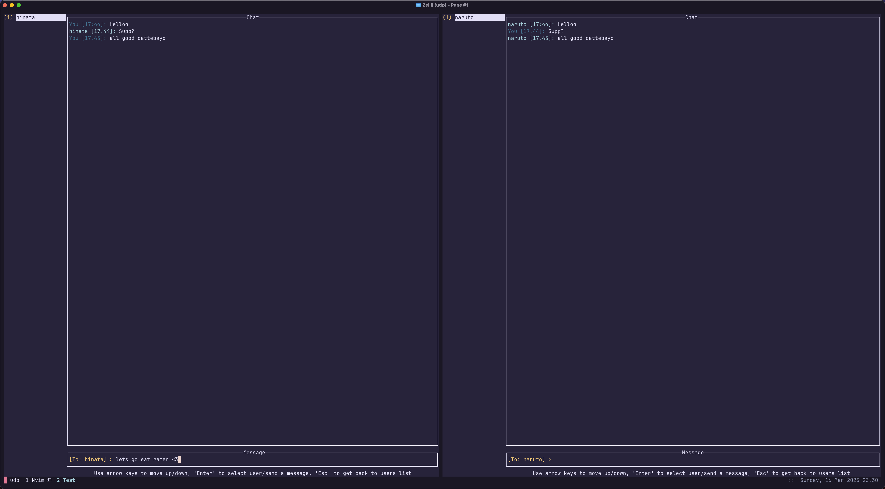

# UDP Client Search and Messaging TUI App

This is a terminal-based user interface (TUI) app written in Go that allows users to search for clients over UDP and send messages to them. It uses a TUI for interaction and UDP for client discovery.

## Features
- **Client Discovery**: Search for clients on the network using UDP.
- **Messaging**: Send messages to discovered clients.
- **Terminal User Interface (TUI)**: A simple terminal UI for interacting with the app.
  
## Run Manually
1. Clone the repository.

2. Install dependencies:
```bash
go mod tidy
```

3. Run the app:
```bash
go run main.go enter_your_username
```

## Run With Makefile
1. Make sure you have docker installed.

2. Build docker image
```bash
make build
```

3. Run instance 1
```bash
make run1
```

4. Run instance 2
```bash
make run2
```

## Screenshots

